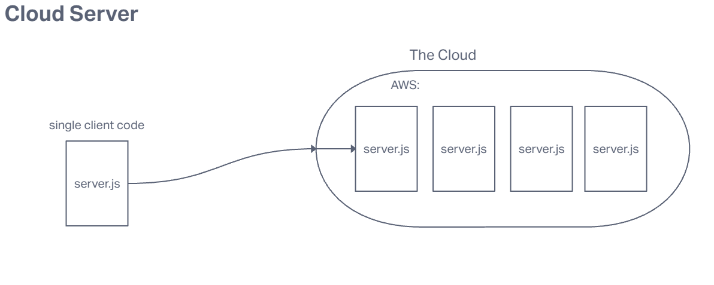

# LAB - Class 16

## Project: AWS: Cloud Servers

### Author: Emmanuel Gonzales

### Problem Domain  

This is a simple server that will be deployed on AWS. This was made to teach me how to deploy apps on AWS

### Links and Resources

- [GUI Deploy](http://cloud-server-dev22.us-east-2.elasticbeanstalk.com)
- [CLI Deploy](http://lab-16-env.eba-endtudtg.us-east-2.elasticbeanstalk.com/)

### Collaborators

### Setup

#### `.env` requirements (where applicable)

PORT = <`SERVER`>

#### How to initialize/run your application (where applicable)

`npm init -y`
`node server.js`

#### How to use your library (where applicable)

#### Features / Routes

- Feature One: Details of feature
- GET : `/` - Proof of life
- GET : `/hello` - Ment to test search querys

#### Tests

No tests

#### Processes

1. Create a server on your local machine and verify it works
2. In your file explorer, select the code you want deployed and the package.json and compress them into a compressed folder by right clicking and selecting 'compress to zip file'
3. If you haven't already created an AWS account. In the services menu select the Elastic Beanstalk option and click 'create application'
4. Follow out the proper steps and deploy the compressed file from your local computer.

IAM

1. Search IAM in the search bar.
2. Follow the instructions to make a profile with administrator rights
3. Go into your terminal and type eb init, select default names and region.
4. Now type eb create, select default names, region and no extras.
5. Type the access key and secret when prompted.

#### UML

